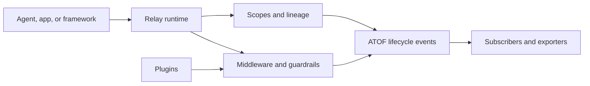

<!--
SPDX-FileCopyrightText: Copyright (c) 2026, NVIDIA CORPORATION & AFFILIATES. All rights reserved.
SPDX-License-Identifier: Apache-2.0
-->

# NeMo Relay

**A runtime boundary for observable, policy-aware AI agents.**

[](LICENSE)
[](RELEASING.md)
[](https://www.rust-lang.org/)
[](https://www.python.org/)
[](https://nodejs.org/)

NeMo Relay wraps the places where an agent interacts with models, tools,
middleware, plugins, and telemetry. It gives application code, framework
integrations, coding-agent hooks, and observability backends one execution
contract without replacing the agent or provider SDK.

> **Project status:** this checkout is a hardened development line, not a
> release qualification certificate. Use the qualification harness and the
> pinned devcontainer before promoting it to production.

## Why Relay?

Agent systems become difficult to operate when every framework invents its own
scope, policy, and telemetry semantics. Relay centralizes those boundaries:

- **Scopes** provide run, turn, tool, LLM, and subagent lineage with isolated
  lifecycle state.
- **Managed execution** applies guardrails, request intercepts, execution
  intercepts, callbacks, and response sanitizers in a defined order.
- **Plugins** package reusable runtime behavior and configuration-driven
  lifecycle management.
- **ATOF events** provide a canonical lifecycle stream that can be projected to
  ATIF trajectories, OpenTelemetry, and OpenInference-compatible outputs.
- **Adaptive components** provide opt-in hints, response caching, and
  performance-aware behavior while preserving correctness and identity
  boundaries.



Relay is intentionally a boundary layer. Your application still owns agent
logic, provider credentials, tool implementation, and the final destination
for exported telemetry.

## Start here

| You want to… | Use |
| --- | --- |
| Instrument a Python application | [Python quick start](https://docs.nvidia.com/nemo/relay/getting-started/quick-start/python) |
| Instrument a Node.js application | [Node.js quick start](https://docs.nvidia.com/nemo/relay/getting-started/quick-start/nodejs) |
| Add Relay to a Rust runtime | [Rust quick start](https://docs.nvidia.com/nemo/relay/getting-started/quick-start/rust) |
| Observe Codex or Claude Code | [CLI guide](https://docs.nvidia.com/nemo/relay/nemo-relay-cli/about) |
| Connect LangChain, LangGraph, or Deep Agents | [Supported integrations](https://docs.nvidia.com/nemo/relay/supported-integrations/about) |
| Build a plugin or exporter | [Plugin guide](https://docs.nvidia.com/nemo/relay/build-plugins/about) |
| Work on this source tree | [Contributing guide](CONTRIBUTING.md) |

## Install

### Python

```bash
uv add nemo-relay
# Optional framework integrations:
uv add "nemo-relay[langchain,langgraph,deepagents]"
```

### Node.js

Node.js 24 or newer is required.

```bash
npm install nemo-relay-node@0.9.1-rc.1
```

### Rust

```bash
cargo add nemo-relay
```

### CLI

```bash
pip install nemo-relay-cli-bin
nemo-relay --version
```

The CLI can also be installed with the platform installer:

```bash
curl -fsSL https://raw.githubusercontent.com/dawsonblock/NEMO/main/install.sh | sh
```

## A minimal managed call

The public bindings preserve the same runtime model. This Python example
creates a scope, records a mark, and routes an application-owned model call
through Relay's managed boundary:

```python
import nemo_relay
from nemo_relay import ScopeType


def provider(request):
    return {"text": "hello from the provider"}


with nemo_relay.scope.scope("demo", ScopeType.AGENT):
    nemo_relay.scope.mark("before_model")
    result = nemo_relay.llm.call({"model": "demo", "messages": []}, provider)
    print(result)
```

For production integrations, use the documented codecs and wrappers so request
and response shapes stay provider-correct:

- [Wrap LLM calls](https://docs.nvidia.com/nemo/relay/integrate-into-frameworks/wrap-llm-calls)
- [Wrap tool calls](https://docs.nvidia.com/nemo/relay/integrate-into-frameworks/wrap-tool-calls)
- [Use provider codecs](https://docs.nvidia.com/nemo/relay/integrate-into-frameworks/using-codecs)

## CLI observability

Run a coding agent through Relay, then inspect the raw event stream and the
normalized trajectory:

```bash
nemo-relay plugins edit
nemo-relay codex -- exec "Summarize this repository."

test -s .nemo-relay/atof/events.jsonl
ls .nemo-relay/atif/*.json
```

The raw ATOF stream is the source record for what Relay observed. ATIF and
OpenTelemetry exports are derived projections. Read the complete [CLI quick
start](https://docs.nvidia.com/nemo/relay/nemo-relay-cli/about) for Claude Code,
Codex, gateway, exporter, and troubleshooting options.

## Runtime contract

Managed execution follows this order:

1. Conditional execution guardrails
2. Request intercepts
3. Request sanitizers for start events
4. Execution intercepts
5. The application callback
6. Response sanitizers for end events

Execution middleware can block, rewrite, route, retry, replace, or wrap the
real callback. Sanitizers affect observability payloads only; they do not
silently mutate the application's request or return value.

The hardened development line also provides:

- bounded priority subscriber queues with queue-health metrics;
- fallible Node stream finalizers that preserve callback errors;
- effective plugin-policy validation via `nemo-relay plugins validate --effective`;
- cache write drain barriers and keyed single-flight for buffered misses;
- explicit session, principal, tenant, and global cache-sharing modes;
- semantic tool-cache classes that keep side-effecting tools uncached;
- disabled-by-default authority, ledger, executor, isolation, and DLP contract
  crates for future qualified enforcement.

Telemetry is not a durable authority or audit ledger. The skeleton hardening
crates are deliberately not wired into execution.

## Support matrix

| Surface | Status | Notes |
| --- | --- | --- |
| Rust runtime | Supported | Source of truth for runtime semantics. |
| Python binding | Supported | PyO3 extension plus ergonomic Python wrappers. |
| Node.js binding | Supported | N-API binding with generated TypeScript surface. |
| Relay CLI | Supported | Agent hooks, gateway routing, and local observability. |
| Go binding | Experimental | Source-first binding over the C FFI. |
| Raw C FFI | Experimental | ABI surface for downstream bindings. |

Current framework integrations include LangChain, LangGraph, Deep Agents, and
OpenClaw. Host-specific capabilities vary; blocking security hooks and model
routing depend on what the host exposes.

## Repository layout

```text
crates/core/       Rust runtime and public execution APIs
crates/adaptive/  Adaptive hints, response cache, and cache telemetry
crates/plugin/    Plugin SDK and lifecycle helpers
crates/cli/       Relay gateway, agent hooks, and configuration CLI
crates/python/    PyO3 native extension
crates/node/      N-API binding and TypeScript package
crates/ffi/       Experimental C ABI
python/           Python package and tests
go/               Experimental Go binding
docs/             Fern documentation source
scripts/          Stable build, test, docs, and qualification wrappers
```

## Build and test from source

Prerequisites are Rust 1.96.1, Python 3.11+, Node.js 24+, Go 1.26+, `uv`, and
`just`. The reproducible environment is defined in `.devcontainer/`.

```bash
uv sync
npm ci --ignore-scripts

just build-all
just test-rust
just test-python
just test-node
just test-go
```

For a bounded local diagnostic:

```bash
scripts/qualification/run.sh quick
```

For the pinned qualification matrix, open the repository in the devcontainer
and run:

```bash
scripts/qualification/run.sh
```

Qualification results are written to `qualification/`. Missing tools and
incomplete coverage remain visible as `NOT_RUN` or `INCONCLUSIVE`; they are
never treated as an implicit pass.

## Documentation and contribution

- [Documentation](https://docs.nvidia.com/nemo/relay)
- [Contributing](CONTRIBUTING.md)
- [Security policy](SECURITY.md)
- [Release process](RELEASING.md)
- [Local hardening notes](docs/reference/hardening.mdx)

Please open an issue before submitting an external contribution. Keep public
behavior aligned across Rust, Python, and Node.js, and include focused tests for
every binding affected by a runtime contract change.

## License

NeMo Relay is licensed under the [Apache License 2.0](LICENSE).
