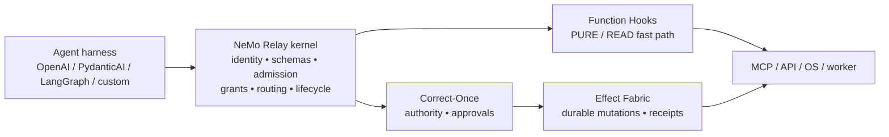

<!--
SPDX-FileCopyrightText: Copyright (c) 2026, NVIDIA CORPORATION & AFFILIATES. All rights reserved.
SPDX-License-Identifier: Apache-2.0
-->

# NeMo Relay

**A managed execution kernel for agent applications.**

[](LICENSE)
[](RELEASING.md)
[](https://www.rust-lang.org/)
[](https://www.python.org/)
[](https://nodejs.org/)

NeMo Relay sits between an agent harness and the functions, tools, models, and
providers that the harness calls. It gives those calls one consistent runtime
boundary for identity, scopes, middleware, schemas, capability admission,
route binding, lifecycle events, and observability.

Relay is intentionally not an agent planner or a durable side-effect service.
The application owns orchestration and provider credentials. Correct-Once owns
authority and approvals. Effect Fabric owns durable mutations. Relay connects
those systems without pretending to replace them.

> **Development status:** `0.9.1-rc.4` is a hardening development line. The
> checked-in qualification record is provenance-bound but currently
> `INCONCLUSIVE` with `DEV` promotion. It is not a production certificate.

## The kernel boundary



### Relay owns

- Immutable capability registration and restricted schema enforcement
- Runtime identity and execution-class pinning
- Admission and bounded provider execution
- Exact argument, route, and grant binding
- Scopes, middleware, interceptors, lifecycle events, and telemetry
- Backend selection between fast execution and consequential effects

### Relay does not own

- LLM planning, agent memory, or workflow/DAG orchestration
- An authoritative policy language or approval service
- A durable effect ledger or exactly-once provider execution
- Hostile-code VM/container implementation
- Provider-specific credentials, retry engines, or MCP servers

The authority, ledger, executor, isolation, and DLP crates in this repository
are explicit interface contracts. Their enforcement flags remain disabled until
qualified implementations are connected.

## Capability routing

Capabilities are registered with an immutable descriptor, input schema,
execution class, and route. The caller cannot downgrade the class, replace the
identity, redirect the route, or alter the arguments after a grant is issued.

| Class      | Runtime path                          | Typical examples                                      |
| ---------- | ------------------------------------- | ----------------------------------------------------- |
| `PURE`     | Function Hooks                        | deterministic transforms, hashing, local calculations |
| `READ`     | Function Hooks or a safe read adapter | search, lookup, snapshot, provider reads              |
| `MUTATION` | Correct-Once → Effect Fabric          | file writes, issue creation, state changes            |
| `CRITICAL` | Correct-Once approval → Effect Fabric | send, delete, publish, security-sensitive actions     |

The Node Correct-Once integration uses signed `coap3` grants bound to the
subject, capability, admission, policy version, operation, registered route,
action ID, idempotency key, and canonical argument digest.

Malformed or mismatched gateway receipts are treated as
`RECONCILIATION_REQUIRED`, never as ordinary retryable failures. The reference
bridge records `PREPARED → DISPATCHING → COMMITTED|FAILED|UNKNOWN`; durable
state and reconciliation remain Effect Fabric responsibilities.

### Kernel adapter wiring

The opt-in Rust `unstable-hardening` feature exposes the contract-driven
`BackendRouter`. It selects Function Hooks for `PURE`/`READ` and requires an
`AuthorityProvider` before dispatching `MUTATION`/`CRITICAL` work to an
`ExecutionBackend`. Correct-Once and Effect Fabric implementations plug into
those contracts; Relay does not import their policy, database, or provider
internals.

## Start here

| Goal                          | Guide                                                                                              |
| ----------------------------- | -------------------------------------------------------------------------------------------------- |
| Add Relay to Python           | [Python quick start](https://docs.nvidia.com/nemo/relay/getting-started/quick-start/python)        |
| Add Relay to Node.js          | [Node.js quick start](https://docs.nvidia.com/nemo/relay/getting-started/quick-start/nodejs)       |
| Add Relay to Rust             | [Rust quick start](https://docs.nvidia.com/nemo/relay/getting-started/quick-start/rust)            |
| Wrap a tool or model          | [Framework integration guides](https://docs.nvidia.com/nemo/relay/integrate-into-frameworks/about) |
| Observe Codex or Claude Code  | [Relay CLI](https://docs.nvidia.com/nemo/relay/nemo-relay-cli/about)                               |
| Build a plugin                | [Plugin guide](https://docs.nvidia.com/nemo/relay/build-plugins/about)                             |
| Contribute to this repository | [Contributing](CONTRIBUTING.md)                                                                    |

## Install

### Python

```bash
uv add nemo-relay
```

Optional framework integrations:

```bash
uv add "nemo-relay[langchain,langgraph,deepagents]"
```

### Node.js

Use Node.js 24.x for this development line:

```bash
nvm use
npm install nemo-relay-node@0.9.1-rc.4
```

### Rust

```bash
cargo add nemo-relay
```

### CLI

```bash
pip install nemo-relay-cli-bin
nemo-relay --version
```

The upstream installer targets NVIDIA GitHub Releases and does not install
this unpublished development branch:

```bash
curl -fsSL https://raw.githubusercontent.com/NVIDIA/NeMo-Relay/main/install.sh | sh
```

## Quick start: Python

Relay wraps an application-owned callback; it does not take ownership of the
provider or planner.

```python
import asyncio

import nemo_relay


async def provider(request: nemo_relay.LLMRequest):
    return {"text": "hello from the provider", "model": request.content["model"]}


async def main() -> None:
    request = nemo_relay.LLMRequest(
        {},
        {"model": "demo-model", "messages": [{"role": "user", "content": "hi"}]},
    )

    with nemo_relay.scope.scope("demo-agent", nemo_relay.ScopeType.Agent) as handle:
        result = await nemo_relay.llm.execute(
            "demo-provider",
            request,
            provider,
            handle=handle,
            model_name="demo-model",
        )

    print(result)


asyncio.run(main())
```

Continue with [LLM wrapping](https://docs.nvidia.com/nemo/relay/integrate-into-frameworks/wrap-llm-calls),
[tool wrapping](https://docs.nvidia.com/nemo/relay/integrate-into-frameworks/wrap-tool-calls),
and [provider codecs](https://docs.nvidia.com/nemo/relay/integrate-into-frameworks/using-codecs).

## Quick start: Correct-Once boundary

The self-contained Node integration demonstrates the intended routing contract:

```bash
npm ci --ignore-scripts
npm test --workspace=nemo-relay-correct-once
```

Use the real Correct-Once authority and the real Effect Fabric for consequential
production effects. The local `EffectFabricBridge` is a reference adapter with
process-local receipts and in-flight protection; it is not durable exactly-once
execution.

## Runtime contract

Managed execution follows this order:

1. Conditional guardrails
2. Request interceptors
3. Request observation sanitizers
4. Execution interceptors
5. The application callback
6. Response observation sanitizers
7. Lifecycle events and exporters

Sanitizers change emitted observability data only. They do not silently rewrite
the real callback arguments or return value. ATOF is the canonical lifecycle
event format; ATIF, OpenTelemetry, and OpenInference outputs are projections.

## Current safeguards

| Boundary           | Current guarantee                                                                                                                           |
| ------------------ | ------------------------------------------------------------------------------------------------------------------------------------------- |
| Identity           | Runtime subject cannot be overridden per call.                                                                                              |
| Schema             | Registered restricted-schema descriptors are cloned, frozen, and validated before grants. Unsupported or malformed constraints fail closed. |
| Grant binding      | Arguments, execution class, route, admission, policy version, action, and idempotency are signed together.                                  |
| Critical receipts  | Missing, malformed, mismatched, or ambiguous gateway receipts become `UNKNOWN` and require reconciliation.                                  |
| Effect lifecycle   | Reference journaling enforces `PREPARED → DISPATCHING → COMMITTED / FAILED / UNKNOWN`.                                                      |
| Provider admission | Rust adaptive admission bounds active work and pending work, preserves stream permits, and schedules eligible waiters under one state lock. |
| Qualification      | Source, lockfiles, Git lineage, environment, and archive digests are checked explicitly.                                                    |

These safeguards do not claim durable authorization, crash-safe external
execution, hostile-code containment, or outbound DLP. Those guarantees require
the external systems named above.

## Support matrix

| Surface         | Status       | Notes                                                                |
| --------------- | ------------ | -------------------------------------------------------------------- |
| Rust runtime    | Supported    | Source of truth for runtime semantics; Rust 1.96.1 in this checkout. |
| Python binding  | Supported    | Python 3.11+ with PyO3 native extension.                             |
| Node.js binding | Supported    | Node.js 24.x with N-API and TypeScript declarations.                 |
| Relay CLI       | Supported    | Hooks, gateway, and observability workflows.                         |
| Go binding      | Experimental | Source-first CGo binding over the FFI library.                       |
| Raw C FFI       | Experimental | Downstream binding surface.                                          |

Framework integrations include LangChain, LangGraph, Deep Agents, and OpenClaw.
Host capabilities depend on the interfaces exposed by each framework.

## Repository layout

```text
crates/core/       Rust runtime and public execution APIs
crates/adaptive/   Admission, adaptive hints, cache, and telemetry
crates/plugin/     Plugin SDK and lifecycle helpers
crates/cli/        Relay gateway, agent hooks, and CLI
crates/python/     PyO3 native extension
crates/node/       N-API binding and TypeScript package
crates/authority/  Authority interface contracts
crates/ledger/     Effect journal and receipt-store contracts
crates/executor/   Execution backend contracts
crates/isolation/  Worker-isolation contracts
crates/dlp/        Outbound-DLP contracts
python/            Python package and tests
go/                Experimental Go binding
integrations/      Correct-Once and framework integrations
scripts/           Build, test, docs, and qualification wrappers
```

## Build and test from source

Prerequisites: Rust 1.96.1, Python 3.11+, Node.js 24.x, Go 1.21+, `uv`, and
`just`.

```bash
uv sync
npm ci --ignore-scripts

just build-all
just test-rust
just test-python
just test-node
just test-go
```

For the adapter contracts specifically:

```bash
cargo fmt --all -- --check
cargo check -p nemo-relay-authority -p nemo-relay-ledger \
  -p nemo-relay-executor -p nemo-relay-isolation -p nemo-relay-dlp --all-features
```

## Qualification and provenance

The qualification pipeline is fail-closed. `NOT_RUN` and `INCONCLUSIVE` never
become implicit passes.

```bash
# Verify the current source against the checked-in evidence.
just provenance-check

# Run the full pinned matrix in the devcontainer.
just qualification

# Refresh only source/environment evidence when no full matrix is available.
just qualification provenance
```

To build and bind a deterministic source archive:

```bash
python3 scripts/qualification/package_release.py \
  --version 0.9.1-rc.4

export NEMO_RELAY_RELEASE_ARCHIVE=release/artifacts/NEMO-0.9.1-rc.4-source.zip
export NEMO_RELAY_SOURCE_ARCHIVE="$NEMO_RELAY_RELEASE_ARCHIVE"
just qualification provenance
just provenance-check
```

The resulting archive has normalized paths, timestamps, and permissions. It is
an evidence-bound source candidate; it is not a production certificate until
the complete Rust, Python, Node, Go, security, provider, and recovery gates
actually pass.

## Documentation and contribution

- [Documentation](https://docs.nvidia.com/nemo/relay)
- [Contributing](CONTRIBUTING.md)
- [Security policy](SECURITY.md)
- [Release process](RELEASING.md)
- [Fork provenance](FORK_PROVENANCE.md)
- [Local hardening notes](docs/reference/hardening.mdx)

Please open an issue before submitting an external contribution. Keep public
behavior aligned across Rust, Python, and Node.js, and include focused tests for
every binding affected by a runtime contract change.

## License

NeMo Relay is licensed under the [Apache License 2.0](LICENSE).
