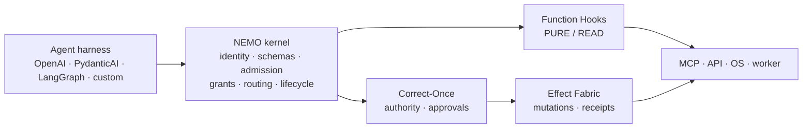

<!--
SPDX-FileCopyrightText: Copyright (c) 2026, NVIDIA CORPORATION & AFFILIATES. All rights reserved.
SPDX-License-Identifier: Apache-2.0
-->

<div align="center">

# NEMO

**A managed execution kernel for agent applications, with a trust boundary you can measure.**

[](LICENSE)
[](RELEASING.md)
[](https://www.rust-lang.org/)
[](https://www.python.org/)
[](https://nodejs.org/)

[Documentation](https://docs.nvidia.com/nemo/relay) ·
[Quick start](#quick-start) ·
[Security posture](#security-posture) ·
[Contributing](CONTRIBUTING.md) ·
[Security policy](SECURITY.md)

</div>

> **Development status.** `0.9.1-rc.4` is a hardening development line. The
> checked-in qualification record is provenance-bound but reports
> `INCONCLUSIVE` with `DEV` promotion. It is not a production certificate.

---

## What this is

NEMO sits between an agent harness and the functions, tools, models, and
providers that harness calls. It gives those calls one runtime boundary for
identity, capability admission, route binding, schemas, middleware, lifecycle
events, and observability — across Rust, Python, and Node.js.

It is deliberately **not** an agent planner and **not** a durable side-effect
service. The application owns orchestration and provider credentials.

| NEMO owns | Something else owns |
| --- | --- |
| Immutable capability registration and schema enforcement | LLM planning, agent memory, workflow orchestration |
| Runtime identity and execution-class pinning | Authoritative policy language and approvals — [Correct-Once](integrations/correct-once) |
| Admission, route binding, and bounded provider execution | Durable mutations and exactly-once execution — Effect Fabric |
| Scopes, middleware, interceptors, lifecycle events, telemetry | Hostile-code isolation and outbound DLP — enforcement is still scaffolding |

The `authority`, `ledger`, `executor`, `isolation`, and `dlp` crates here are
interface contracts. Their enforcement flags stay disabled until qualified
implementations are connected, and this file says so rather than implying
otherwise.

## Architecture



### How a call is routed

A harness submits a capability ID and arguments. Nothing else. The kernel
resolves the registered execution class, identity, route, admission, policy
values, and argument digest itself, so a caller cannot downgrade the class,
replace the identity, or redirect the route.

| Class | Runtime path | Examples |
| --- | --- | --- |
| `PURE` | Function Hooks | deterministic transforms, hashing, local calculation |
| `READ` | Function Hooks | search, lookup, snapshot, provider reads |
| `MUTATION` | Correct-Once → Effect Fabric | file writes, issue creation, state changes |
| `CRITICAL` | Correct-Once approval → Effect Fabric | send, delete, publish, security-sensitive actions |

Managed execution runs in a fixed order:

**conditional guardrails → request interceptors → request sanitizers →
execution interceptors → your callback → response sanitizers → lifecycle
events.**

Sanitizers change emitted observability data only; they never rewrite the real
callback arguments or return value. ATOF is the canonical lifecycle event
format, and ATIF, OpenTelemetry, and OpenInference are projections of it.

## Quick start

### Python

```bash
uv add nemo-relay
# framework integrations:
uv add "nemo-relay[langchain,langgraph,deepagents]"
```

```python
import asyncio

import nemo_relay


async def provider(request: nemo_relay.LLMRequest):
    return {"text": "hello from the provider", "model": request.content["model"]}


async def main() -> None:
    request = nemo_relay.LLMRequest(
        {},
        {"model": "demo-model", "messages": [{"role": "user", "content": "hi"}]},
    )

    with nemo_relay.scope.scope("demo-agent", nemo_relay.ScopeType.Agent) as handle:
        result = await nemo_relay.llm.execute(
            "demo-provider",
            request,
            provider,
            handle=handle,
            model_name="demo-model",
        )

    print(result)


asyncio.run(main())
```

Relay wraps a callback your application owns. Next steps:
[LLM wrapping](https://docs.nvidia.com/nemo/relay/integrate-into-frameworks/wrap-llm-calls),
[tool wrapping](https://docs.nvidia.com/nemo/relay/integrate-into-frameworks/wrap-tool-calls),
[provider codecs](https://docs.nvidia.com/nemo/relay/integrate-into-frameworks/using-codecs).

### Node.js

```bash
nvm use                                     # Node 24.x
npm install nemo-relay-node@0.9.1-rc.4
```

### Rust

```bash
cargo add nemo-relay
```

### CLI

```bash
pip install nemo-relay-cli-bin
nemo-relay --version
```

### See the routing contract end to end

```bash
npm ci --ignore-scripts
npm test --workspace=nemo-relay-correct-once
```

The local `EffectFabricBridge` in that integration is a reference adapter with
process-local receipts. Use the real Correct-Once authority and the real Effect
Fabric for consequential production effects.

## Security posture

NEMO treats its own trusted computing base as a measured quantity rather than a
claim, and the measurement is enforced in CI.

```bash
just tcb-report          # trusted surface, budgets, and forbidden dependencies
just layer-report        # dependency-layer rules; fails on a new upward edge
just test-tcb-scripts    # the gates' own tests
```

`security/tcb.toml` records three surfaces separately, because they answer
different questions:

| Surface | What it is |
| --- | --- |
| Invariant-enforcing | Code that *enforces* a kernel invariant. A function earns a place here by enforcing one of the properties in `security/INVARIANTS.md`. |
| Effective in-process | Everything linked into the same process, which can subvert an invariant without enforcing it. |
| Plugin host | The process that will host native plugins, reported separately and not counted against the kernel. |

Every budget is a ratchet: exceeding one fails the build, and each crate's
resolved dependency set — versions included — is pinned by digest, so swapping a
package for another cannot pass by keeping the count equal. `just tcb-report`
prints the live figures; they move with the code, which is why they are not
copied here.

What the numbers currently show, and what they do not:

- Runtime identity, capability and grant verification, routing, idempotency,
  effect state transitions, receipts, and lease fencing are enforced, and
  several are structural rather than conventional — only a sealed registry can
  produce a kernel, and an action that may have been dispatched becomes
  `UNKNOWN` rather than `FAILED` by a total `match` with no catch-all.
- The kernel is still larger than its target, and most of its remaining `unsafe`
  is the dynamic native plugin loader. Relocating that loader to another crate
  would change nothing, because it would still share the address space;
  `security/PLUGIN-ISOLATION.md` records the program to move it behind a process
  boundary, and `kernel-process unsafe tokens` is the number that has to fall.
- DLP, sandboxing, and provider isolation are contracts, not enforcement. Their
  flags are `false` in the source, deliberately.

Full detail: [hardening reference](docs/reference/hardening.mdx) ·
[invariants](security/INVARIANTS.md) · [TCB policy](security/tcb.toml) ·
[plugin isolation program](security/PLUGIN-ISOLATION.md).

## Support matrix

| Surface | Status | Notes |
| --- | --- | --- |
| Rust runtime | Supported | Source of truth for runtime semantics |
| Python binding | Supported | Python 3.11+, PyO3 native extension |
| Node.js binding | Supported | Node.js 24.x, N-API with TypeScript declarations |
| Relay CLI | Supported | Hooks, gateway, observability |
| Go binding | Experimental | Source-first CGo over the FFI library |
| Raw C FFI | Experimental | Downstream binding surface |

Integrations cover LangChain, LangGraph, Deep Agents, and OpenClaw. What each
supports depends on the interfaces that framework exposes.

## Repository layout

```text
crates/
  core/              runtime and public execution APIs
  adaptive/          admission, adaptive hints, cache, telemetry
  plugin/            plugin SDK and lifecycle helpers
  plugin-protocol/   domain vocabulary and invariants for plugin execution
  plugin-proto/      gRPC wire schema for the plugin process boundary
  plugin-host/       plugin execution backends and their conformance suite
  cli/               gateway, agent hooks, CLI
  python/ node/ ffi/ language bindings
  authority/ ledger/ executor/ isolation/ dlp/   interface contracts
python/              Python package and tests
go/                  experimental Go binding
integrations/        Correct-Once and framework integrations
security/            TCB policy, layer policy, invariants, baselines
qualification/       evidence, baselines, ABI vectors
scripts/             build, test, docs, and qualification entry points
```

## Build and test

Prerequisites: Rust 1.96.1, Python 3.11+, Node.js 24.x, Go 1.21+, `uv`, `just`.

```bash
uv sync
npm ci --ignore-scripts

just build-all
just test-all          # or: just test-rust / test-python / test-node / test-go
```

Before opening a pull request:

```bash
cargo fmt --all
cargo clippy --workspace --all-targets -- -D warnings
uv run pre-commit run --all-files
```

Touching the Rust core invalidates every binding, so run the whole matrix rather
than the crate you changed.

## Qualification

The qualification pipeline is fail-closed: `NOT_RUN` and `INCONCLUSIVE` never
become implicit passes.

```bash
just provenance-check     # verify this source against the checked-in evidence
just qualification        # run the full pinned matrix in the devcontainer
```

To build and bind a deterministic source archive:

```bash
python3 scripts/qualification/package_release.py --version 0.9.1-rc.4
export NEMO_RELAY_RELEASE_ARCHIVE=release/artifacts/NEMO-0.9.1-rc.4-source.zip
export NEMO_RELAY_SOURCE_ARCHIVE="$NEMO_RELAY_RELEASE_ARCHIVE"
just qualification provenance
just provenance-check
```

Packaging refuses a missing, invalid, or source-mismatched record. The archive
has normalized paths, timestamps, and permissions, and is an evidence-bound
source candidate rather than a production certificate.

## Contributing

Please open an issue before an external contribution. Keep public behavior
aligned across Rust, Python, and Node.js, and include focused tests for every
binding a runtime-contract change touches.

- [Contributing](CONTRIBUTING.md) · [Release process](RELEASING.md) · [Security policy](SECURITY.md)
- [Fork provenance](FORK_PROVENANCE.md) — NEMO is a derived development fork of
  [NVIDIA NeMo Relay](https://github.com/NVIDIA/NeMo-Relay), not an official
  NVIDIA release

## License

[Apache License 2.0](LICENSE).
