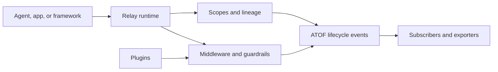

<!--
SPDX-FileCopyrightText: Copyright (c) 2026, NVIDIA CORPORATION & AFFILIATES. All rights reserved.
SPDX-License-Identifier: Apache-2.0
-->

# NeMo Relay

**Observable execution boundaries for AI agents.**

[](LICENSE)
[](RELEASING.md)
[](https://www.rust-lang.org/)
[](https://www.python.org/)
[](https://nodejs.org/)

NeMo Relay is a multi-language runtime boundary for applications that call
LLMs, tools, agents, and plugins. It gives those calls one consistent model for
scope lineage, middleware, lifecycle events, callbacks, and observability while
leaving orchestration and provider ownership in the application.

> **Status:** This checkout is a hardened `0.9.1-rc.1` development line. The
> checked-in qualification snapshot is provenance-bound but `INCONCLUSIVE`/`DEV`;
> it is not a production or release certificate. See
> [Qualification](#qualification) before promoting a build.

## Why Relay?

Agent systems become difficult to operate when every framework invents its own
scope, policy, and telemetry semantics. Relay centralizes those boundaries:

- **Scopes** provide run, turn, tool, LLM, and subagent lineage with isolated
  lifecycle state.
- **Managed execution** applies guardrails, request intercepts, execution
  intercepts, callbacks, and response sanitizers in a defined order.
- **Plugins** package reusable runtime behavior and configuration-driven
  lifecycle management.
- **ATOF events** provide a canonical lifecycle stream that can be projected to
  ATIF trajectories, OpenTelemetry, and OpenInference-compatible outputs.
- **Adaptive components** provide opt-in hints, response caching, and
  performance-aware behavior while preserving correctness and identity
  boundaries.



Relay is intentionally a boundary layer. Your application still owns agent
logic, provider credentials, tool implementation, and the final destination
for exported telemetry.

## Start here

| You want to… | Use |
| --- | --- |
| Instrument a Python application | [Python quick start](https://docs.nvidia.com/nemo/relay/getting-started/quick-start/python) |
| Instrument a Node.js application | [Node.js quick start](https://docs.nvidia.com/nemo/relay/getting-started/quick-start/nodejs) |
| Add Relay to a Rust runtime | [Rust quick start](https://docs.nvidia.com/nemo/relay/getting-started/quick-start/rust) |
| Observe Codex or Claude Code | [CLI guide](https://docs.nvidia.com/nemo/relay/nemo-relay-cli/about) |
| Connect LangChain, LangGraph, or Deep Agents | [Supported integrations](https://docs.nvidia.com/nemo/relay/supported-integrations/about) |
| Build a plugin or exporter | [Plugin guide](https://docs.nvidia.com/nemo/relay/build-plugins/about) |
| Work on this source tree | [Contributing guide](CONTRIBUTING.md) |

## Install

### Python

```bash
uv add nemo-relay
# Optional framework integrations:
uv add "nemo-relay[langchain,langgraph,deepagents]"
```

### Node.js

Node.js 24 or newer is required.

```bash
npm install nemo-relay-node@0.9.1-rc.1
```

### Rust

```bash
cargo add nemo-relay
```

### CLI

```bash
pip install nemo-relay-cli-bin
nemo-relay --version
```

The checked-in platform installers target the upstream NVIDIA release
repository. Use them when you want an upstream GitHub Release binary; they do
not install an unpublished build from this fork:

```bash
curl -fsSL https://raw.githubusercontent.com/NVIDIA/NeMo-Relay/main/install.sh | sh
```

## Quick start: Python

Install the Python binding:

```bash
uv add nemo-relay
```

Then route an application-owned provider callback through a Relay scope:

```python
import asyncio

import nemo_relay


async def provider(request: nemo_relay.LLMRequest):
    return {"text": "hello from the provider", "model": request.content["model"]}


async def main() -> None:
    request = nemo_relay.LLMRequest(
        {},
        {"model": "demo-model", "messages": [{"role": "user", "content": "hi"}]},
    )

    with nemo_relay.scope.scope("demo-agent", nemo_relay.ScopeType.Agent) as handle:
        nemo_relay.scope.event("before-model", handle=handle)
        result = await nemo_relay.llm.execute(
            "demo-provider",
            request,
            provider,
            handle=handle,
            model_name="demo-model",
        )

    print(result)


asyncio.run(main())
```

For codecs, streaming, and framework adapters, start with the
[Python quick start](https://docs.nvidia.com/nemo/relay/getting-started/quick-start/python),
[LLM integration guide](https://docs.nvidia.com/nemo/relay/integrate-into-frameworks/wrap-llm-calls),
and [tool integration guide](https://docs.nvidia.com/nemo/relay/integrate-into-frameworks/wrap-tool-calls):

- [Wrap LLM calls](https://docs.nvidia.com/nemo/relay/integrate-into-frameworks/wrap-llm-calls)
- [Wrap tool calls](https://docs.nvidia.com/nemo/relay/integrate-into-frameworks/wrap-tool-calls)
- [Use provider codecs](https://docs.nvidia.com/nemo/relay/integrate-into-frameworks/using-codecs)

## CLI observability

Run a coding agent through Relay, then inspect the raw event stream and the
normalized trajectory:

```bash
nemo-relay plugins edit
nemo-relay codex -- exec "Summarize this repository."

test -s .nemo-relay/atof/events.jsonl
ls .nemo-relay/atif/*.json
```

The raw ATOF stream is the source record for what Relay observed. ATIF and
OpenTelemetry exports are derived projections. Read the complete [CLI quick
start](https://docs.nvidia.com/nemo/relay/nemo-relay-cli/about) for Claude Code,
Codex, gateway, exporter, and troubleshooting options.

## Runtime contract

Managed execution follows this order:

1. Conditional execution guardrails
2. Request intercepts
3. Request sanitizers for start events
4. Execution intercepts
5. The application callback
6. Response sanitizers for end events

Execution middleware can block, rewrite, route, retry, replace, or wrap the
real callback. Sanitizers affect observability payloads only; they do not
silently mutate the application's request or return value.

The hardened development line provides the following safeguards:

| Area | Behavior |
| --- | --- |
| Streaming finalizers | Rust, Python, Node.js, and C FFI preserve callback, malformed JSON, invalid UTF-8, and null-pointer errors. A valid JSON `null` remains a valid result. |
| Queue safety | Runtime delivery queues have explicit capacities and overflow policies. Lifecycle/security traffic uses backpressure or rejection; telemetry may be dropped with metrics. Nested publications are capped. |
| Cache identity | Session, principal, tenant, and global sharing modes are explicit. Principal and tenant modes require an immutable `RuntimeIdentity`; ordinary scope metadata cannot spoof the partition. |
| Cache semantics | Pure and approved read classes may cache. Volatile and side-effecting tools are never cached. Cache writes expose deterministic drain barriers. |
| Plugin lifecycle | Built-in registrations are owner- and implementation-aware, so a same-name collision is not accepted as an equivalent plugin. |
| Qualification | Reports include source-tree, environment, lockfile, and Git provenance plus an explicit reason for every `PASS`, `FAIL`, `NOT_RUN`, or `INCONCLUSIVE` result. |

These safeguards do not claim capabilities that are not enabled. The authority,
ledger, durable executor, isolation, and outbound-DLP crates are currently
disabled contract skeletons. Native and worker plugins are isolated processes,
not hostile-code sandboxes, and telemetry is not a durable audit ledger.

## Support matrix

| Surface | Status | Runtime / notes |
| --- | --- | --- |
| Rust runtime | Supported | Rust 1.96.1 in this checkout; source of truth for runtime semantics. |
| Python binding | Supported | Python 3.11+; PyO3 extension plus Python wrappers. |
| Node.js binding | Supported | Node.js 24+; N-API binding with TypeScript declarations. |
| Relay CLI | Supported | Python 3.11+ or packaged binary; hooks, gateway, and observability. |
| Go binding | Experimental | Go 1.21+; source-first binding over the C FFI. |
| Raw C FFI | Experimental | C ABI for downstream bindings. |

Current framework integrations include LangChain, LangGraph, Deep Agents, and
OpenClaw. Host-specific capabilities vary; blocking security hooks and model
routing depend on what the host exposes.

## Repository layout

```text
crates/core/       Rust runtime and public execution APIs
crates/adaptive/   Adaptive hints, response cache, and cache telemetry
crates/plugin/     Plugin SDK and lifecycle helpers
crates/cli/        Relay gateway, agent hooks, and configuration CLI
crates/python/     PyO3 native extension
crates/node/       N-API binding and TypeScript package
crates/ffi/        Experimental C ABI
python/            Python package and tests
go/                Experimental Go binding
docs/              Fern documentation source
scripts/           Build, test, docs, and qualification wrappers
```

## Build and test from source

Prerequisites are Rust 1.96.1, Python 3.11+, Node.js 24+, Go 1.21+, `uv`, and
`just`. The reproducible environment is defined in `.devcontainer/`; its
current Go image is newer than the minimum supported version.

```bash
uv sync
npm ci --ignore-scripts

just build-all
just test-rust
just test-python
just test-node
just test-go
```

For documentation changes, run `just docs` (or `just docs-linkcheck` for a
link-only check). The Rust test recipe uses `cargo-nextest`; install the
repository-pinned development tools before running the full matrix.

For a bounded local diagnostic:

```bash
scripts/qualification/run.sh quick
```

For the pinned qualification matrix, open the repository in the devcontainer
and run:

```bash
scripts/qualification/run.sh
```

Qualification results are written to `qualification/`. Each run first emits a
source manifest, environment digest, lockfile digests, and Git provenance, then
binds `qualification.json` to that evidence. Missing tools and incomplete
coverage remain visible as `NOT_RUN` or `INCONCLUSIVE` with an explicit reason;
they are never treated as an implicit pass.

Use `scripts/qualification/run.sh manifest` to capture provenance without
running checks on a host that lacks the full toolchain. Use
`scripts/qualification/run.sh provenance` when refreshing only the
source/environment binding while preserving existing check logs.

## Documentation and contribution

- [Documentation](https://docs.nvidia.com/nemo/relay)
- [Contributing](CONTRIBUTING.md)
- [Security policy](SECURITY.md)
- [Release process](RELEASING.md)
- [Local hardening notes](docs/reference/hardening.mdx)

Please open an issue before submitting an external contribution. Keep public
behavior aligned across Rust, Python, and Node.js, and include focused tests for
every binding affected by a runtime contract change.

## License

NeMo Relay is licensed under the [Apache License 2.0](LICENSE).
